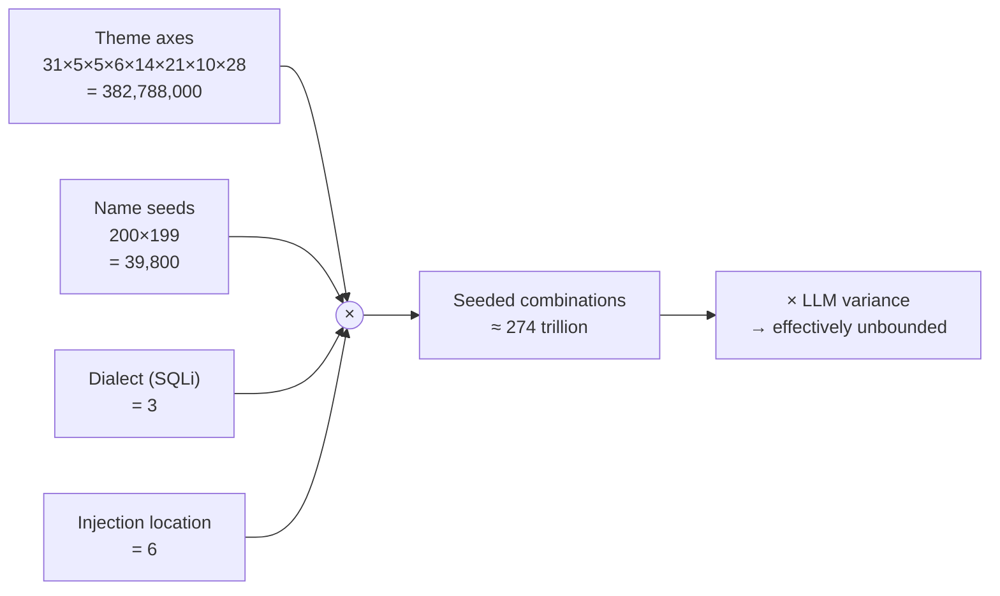

# Entropy per deploy — worked example for SQLi

The class with the most injection-position variants in v1.0 is **WSTG-INPV-05.4
(SQLi)**, with 6 positions in its `INJECTION_LOCATIONS` pool (query, body-form,
body-json, header, cookie, path-segment). Walking through the deterministic
seed-space per deploy:

```
SEEDED ENTROPY PER SQLi DEPLOY
══════════════════════════════════════════════════════════════════════════

  Theme axes (shared across every class — generated upstream):

    industry          × 31        (verticals: agriculture, fintech, healthcare, ...)
    era               ×  5        (1990s legacy ... 2025-era AI-native)
    maturity          ×  5        (solo-founder ... Fortune-500)
    voice             ×  6        (utilitarian, playful, ... brutalist)
    layoutArchetype   × 14        (top-nav, sidebar, magazine, three-pane, ...)
    designLanguage    × 21        (Swiss, neumorphism, glassmorphism, ...)
    colorTreatment    × 10        (light/restrained, dark, pastel, monochrome, ...)
    colorFamily       × 28        (slate, navy, forest green, magenta, ...)
                      ─────
    theme axes        = 382,788,000

  Name seeds (2 distinct picks from a 200-word concrete-noun pool):

    nameSeed₁         × 200
    nameSeed₂         × 199
                      ─────
    name combos       = 39,800

  SQLi class-specific axes:

    dialect           ×   3        (sqlite, postgres, mysql)
    injection-loc     ×   6        (query, body-form, body-json, header, cookie, path-segment)
                      ─────
    SQLi axes         = 18

  TOTAL DETERMINISTIC SEED COMBINATIONS

    = theme × names × SQLi
    = 382,788,000 × 39,800 × 18
    ≈ 274,200,000,000,000
    ≈ 274 trillion

  × per-call LLM variance (scenario body, parameter name, table names,
    decoys, account/secret pools, content, decoy tables...)

    → effectively unbounded
```

## Shorthand equation

For class C with positions L(C) and per-class axis cardinality A(C):

    Entropy(deploy, C) = 382,788,000 × 39,800 × |L(C)| × A(C) × LLM_variance

For SQLi specifically:

    L(SQLi) = 6
    A(SQLi) = 3   (dialect)
    Entropy(deploy, SQLi) ≈ 2.74 × 10¹⁴ × LLM_variance

## What this means in practice

- An attacker who memorised 100 PolyRange SQLi deploys would see less than
  10⁻¹² of the seed space. They cannot generalise from observed deploys.
- An attacker probing only `?q=` catches at most 1/6 of seeded deploys
  (the query-location ones) — even if dialect and theme don't matter to them,
  they still miss 83% on the position axis alone.
- Per-deploy LLM variance means even two deploys that happen to share the
  same seeded tuple still differ in surface (parameter name, table names,
  decoy rows, page chrome, content).

## Diagram



## Where this lives in code

  - Theme + name pools: `generator/generate-theme.mjs` (`ANCHOR_POOLS`, `NAME_SEEDS`)
  - Dialect pool: `classes/wstg-sqli-4.7.5.4/anchors.mjs` (`DIALECTS`)
  - Injection-location pool: `classes/wstg-sqli-4.7.5.4/anchors.mjs` (`INJECTION_LOCATIONS`)
  - Seeded injection (location): `generator/generate-scenario.mjs` (the
    INJECTION_LOCATIONS branch — picks one location uniformly per deploy and
    injects as a hard constraint)
  - Schema enforcement: `classes/_shared/scenario-common.mjs` (`Slot.location`)
  - Runtime support: `runtime/server.mjs::extractInput` reads from each
    location; `generator/deploy.mjs::fireScenarioRequest` fires payloads at
    each location.
